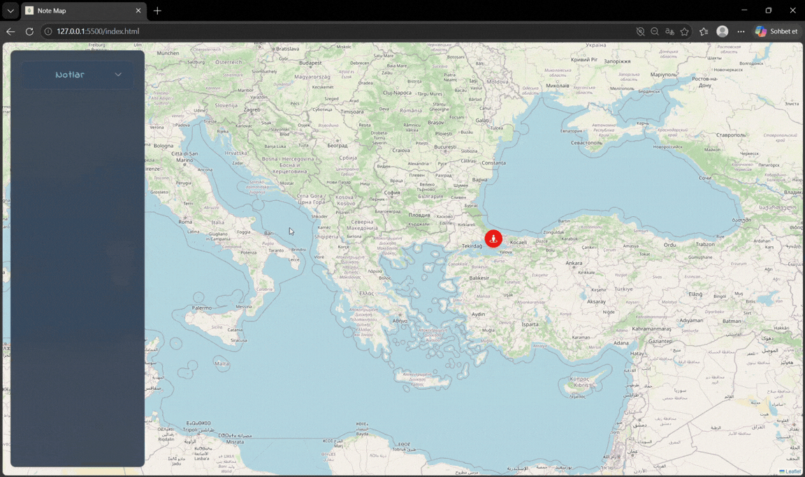

# Geo Notes App

A responsive **Location-Based Note Application** built with HTML, CSS, and JavaScript using **Leaflet.js** for interactive map integration.

---

## Project Purpose

This project was developed to practice location-based applications, map integration, JavaScript state management, and data persistence.

- Create notes by selecting locations on the map
- Manage location-based notes
- Store notes using LocalStorage
- Navigate to saved note locations
- Responsive user interface
- Modular JavaScript structure

---

## Technologies Used

- HTML5
- CSS3
- JavaScript (ES6+)
- Leaflet.js
- OpenStreetMap
- LocalStorage API
- Bootstrap Icons

## Preview

